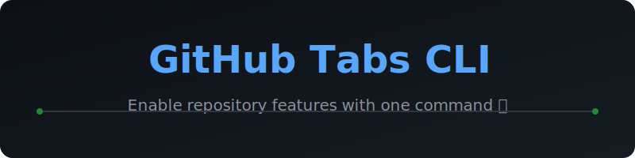

# 🚀 GitHub Tabs CLI

<p align="center">
  
</p>

<p align="center">
  <a href="https://pypi.org/project/github-tabs/">
    
  </a>
  <a href="https://github.com/ishandutta2007/manage-github-tabs-buttons/blob/main/LICENSE">
    
  </a>
  <a href="https://github.com/ishandutta2007/manage-github-tabs-buttons/stargazers">
    
  </a>
  <a href="https://github.com/ishandutta2007/manage-github-tabs-buttons/network/members">
    
  </a>
  <a href="https://github.com/ishandutta2007"></a>
</p>

---

**GitHub Tabs CLI** is a powerful, lightweight command-line tool designed to streamline repository management. Instantly enable or disable GitHub features like **Discussions**, **Wiki**, **Projects**, and the **Sponsor button** without navigating through complex settings pages.

## 🌟 Key Features

- **⚡ Instant Enablement:** Toggle Discussions, Wiki, Issues, Projects, and Pages.
- **💰 One-Click Sponsorships:** Official GraphQL integration to enable the Sponsor button and automatically generate `.github/FUNDING.yml`.
- **🏗️ Template Management:** Convert repositories to templates or vice-versa with ease.
- **🍴 Forking Control:** Quickly toggle repository forking permissions.
- **🔀 Merge Workflow Optimization:** Enable Auto-merge, Squash merge, or Rebase merge buttons instantly.
- **🔍 Smart Auto-Detection:** Automatically identifies the repository owner and name from your local git context.

## 🛠️ Installation

Install the tool globally via PyPI:

```bash
pip install github-tabs
```

## 🚀 Quick Start Guide

### 1. Configuration

Set your GitHub Personal Access Token (with `repo` permissions) in a `.env` file or as an environment variable:

```env
ADMIN_TOKEN=your_github_pat_here
```

### 2. Common Commands

| Target Feature | Command |
| :--- | :--- |
| **Discussions** | `github-tabs Discussions` |
| **Sponsorships** | `github-tabs Sponsorships` |
| **Wiki** | `github-tabs Wiki` |
| **Auto-Merge** | `github-tabs auto-merge` |
| **Template Mode**| `github-tabs template` |

### 3. Usage Examples

**Enable Sponsorships for the current repo:**
> This will enable the flag AND create a default `.github/FUNDING.yml` if it doesn't exist.
```bash
github-tabs Sponsorships
```

**Enable Wiki for a specific user/repo:**
```bash
github-tabs Wiki ishandutta2007 my-awesome-project
```

## 📖 Detailed Options

```bash
github-tabs [-h] [--token TOKEN] tabname [username] [repo]
```

- `tabname`: The name of the tab, button, or feature to enable.
- `username` (optional): The GitHub owner. Defaults to the current authenticated user.
- `repo` (optional): The repository name. Defaults to the current directory.
- `--token` (optional): Provide a token directly, bypassing environment variables.

## 🤝 Contributing

Contributions are welcome! Whether it's a bug report, feature request, or a pull request, feel free to open an issue or submit a PR.

## 📄 License

This project is licensed under the **MIT License**. See the [LICENSE](LICENSE) file for details.

---

<p align="center">
  Made with ❤️ by <a href="https://github.com/ishandutta2007">Ishandutta2007</a>
</p>

## 📈 Star History
<div align="center">
   <a href="https://www.star-history.com/repos=ishandutta2007%2Fmanage-github-tabs-buttons&type=date&legend=bottom-right">
    <picture>
      <source media="(prefers-color-scheme: dark)" srcset="https://api.star-history.com/chartrepos=ishandutta2007/manage-github-tabs-buttons&type=date&theme=dark&legend=bottom-right" />
      <source media="(prefers-color-scheme: light)" srcset="https://api.star-history.com/chartrepos=ishandutta2007/manage-github-tabs-buttons&type=date&legend=bottom-right" />
      
    </picture>
   </a>
</div>
